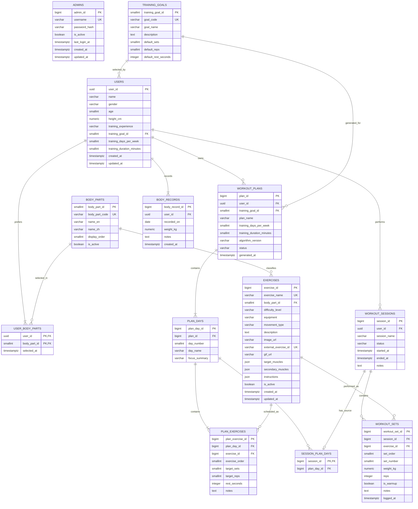

# Fitness Tracking Management System

## Implemented Requirements and Database Design

> Status: Implemented schema with public no-login user flow and protected admin backend.
>
> Public users still have no Login, Register, Email, Password, or account authentication. The only authentication in this project is the separate `/admin` backend for database administration.

## 1. System Requirements

### 1.1 Project objective

Fitness Tracking Management System（健身紀錄管理系統）是一個以 PostgreSQL 關聯式資料庫為核心的 Full-stack Web Application。任何人都能從公開網址直接建立健身資料、選擇訓練目標與重點部位、取得 rule-based 建議課表、記錄每組訓練，並查看歷史與統計。

### 1.2 Explicit no-login requirement

- 首頁不得出現 Login、Register、Sign In 或 Sign Up。
- 不蒐集 Email。
- 不儲存 Password 或 Password Hash。
- 不使用 GitHub Login、OAuth 或其他登入服務。
- 使用者按下「開始建立我的健身計畫」後直接進入建立資料流程。
- 建立成功後，由 PostgreSQL 產生不可預測的 UUID `user_id`。
- 瀏覽器保存 `user_id`，讓同一瀏覽器下次回到相同資料。
- 系統可提供含 UUID 的專屬網址供使用者收藏。

Public user flow 沒有 Authentication，代表系統不能證明誰是資料擁有者。任何取得某個使用者專屬網址或 UUID 的人都可能存取該筆資料，而且清除瀏覽器資料後無法透過 Email／Password 找回。此系統應定位為課程展示與非敏感健身資料工具，介面應建議使用暱稱，不輸入敏感個資。

管理者後台是例外：`/admin/login` 使用獨立 `admins` table、hashed password 與 bearer token 保護 `/api/admin/*` 以及 Exercise 管理 API。

### 1.3 Functional requirements

| ID | Requirement | Expected behavior |
|---|---|---|
| FR-01 | Profile | Create, read, update, and delete Name, optional Gender, Age, Height, Experience |
| FR-02 | Initial weight | 建立 Profile 時同一個 transaction 寫入第一筆 `body_records` |
| FR-03 | Training goal | 從四種 `training_goals` 選擇一個主要目標 |
| FR-04 | Preferred body parts | 透過 `user_body_parts` 選擇一個或多個部位 |
| FR-05 | Availability | 選擇每週 2–6 天及每次 30／60／90 分鐘 |
| FR-06 | Exercise database | 依名稱、部位、難度、器材搜尋與管理 Exercise |
| FR-07 | Plan generation | 只用資料庫資料及 rule-based algorithm 產生建議課表 |
| FR-08 | Plan structure | 課表包含多個 Day；每個 Day 有排序過的 Exercises 與 Sets／Reps |
| FR-09 | Workout tracking | 建立 Session，逐組記錄 Exercise、Weight、Reps、Set Number |
| FR-10 | History | 查看 Workout、Exercise 及 Weight History |
| FR-11 | Statistics | Training Volume、每週訓練次數、最常訓練部位及 Exercise |
| FR-12 | Database queries | 支援 CRUD、Search、JOIN、GROUP BY、Aggregate Functions |
| FR-13 | Dashboard | 以正規化資料即時計算並顯示核心統計 |
| FR-14 | Admin backend | 管理者可查看 Users、User Detail、Statistics、Exercises；一般訪客不能取得全站 users list |

### 1.4 Non-functional and delivery requirements

| ID | Requirement | Later-phase acceptance evidence |
|---|---|---|
| NFR-01 | Public access | 公開 HTTPS 網址可直接使用，不要求 GitHub 或系統登入 |
| NFR-02 | Responsive UX | 手機與電腦皆可完成建立計畫、記錄與查詢 |
| NFR-03 | Cloud persistence | 正式 `DATABASE_URL` 連至 Cloud PostgreSQL，不依賴 localhost |
| NFR-04 | GitHub-ready | Source、migration、tests、documentation 可推送至 GitHub |
| NFR-05 | Secret management | `.env` 不提交；密鑰只透過部署平台 Environment Variables 注入 |
| NFR-06 | Reproducibility | 提供 `.env.example`、migration、seed 與本機啟動步驟 |
| NFR-07 | Database integrity | PostgreSQL 以 PK、FK、UNIQUE、CHECK、transaction 維持正確性 |
| NFR-08 | README | 包含 Project Description、Database Design、ER Diagram、Installation、Environment Variables、Local Development、Deployment、Live Demo |

### 1.5 Version 1 assumptions

1. 使用 PostgreSQL 15 或更新版本。
2. 單位固定為公制：cm、kg、minutes。
3. Exercise 的 `body_part_id` 表示主要訓練部位；每個 Exercise 第一版只有一個主要部位。
4. 假設使用者可使用 Exercise 所標示的器材；第一版不收集可用器材清單。
5. Gender、Age、Height 與 Weight 不參與第一版推薦分數；第一版依明確指定的 Goal、Experience、Preferred Body Parts、Days、Duration 推薦。
6. 使用者至少選擇一個 Preferred Body Part。
7. 同一使用者同一天最多一筆 Weight Record。

## 2. User Flow

### 2.1 First-time visitor

```text
公開首頁
  →「開始建立我的健身計畫」
  → Step 1：輸入 Name、Gender（選填）、Age、Height、Weight、Experience
  → Step 2：選擇 Training Goal
  → Step 3：選擇一個或多個 Preferred Body Parts
  → Step 4：選擇 Training Days Per Week 與 Training Duration
  → Step 5：產生建議課表
  → 查看每週 Plan、Plan Days、Exercises、Sets、Reps
  → 選擇一天並開始 Workout Session
  → 逐組輸入 Weight 與 Reps
  → 完成 Session
  → 查看 Dashboard、History 與 Statistics
```

建立資料時，後端使用單一 transaction 寫入：

1. `users`
2. 第一筆 `body_records`
3. 一筆或多筆 `user_body_parts`

任何一步失敗時全部 rollback，避免只有部分 Profile 被建立。

### 2.2 Returning visitor without login

1. 首頁從瀏覽器 local storage 讀取最近的 `user_id`。
2. 若 UUID 仍有效，顯示「繼續我的計畫」與「建立新資料」。
3. 使用者也可以透過收藏的 UUID 專屬網址返回。
4. 若 local storage 已清除且未收藏網址，系統無法找回原資料，使用者需建立新 Profile。

### 2.3 Main navigation after onboarding

- My Plan
- Start Workout
- Workout History
- Exercise History
- Weight History
- Dashboard
- Edit Profile

## 3. Business Rules

1. 一個 User 必須選一個 Training Goal。
2. 一個 Training Goal 可被多個 Users 選擇，形成 1:N。
3. User 與 Body Part 是 M:N，由 `user_body_parts` junction table 解決。
4. 一個 Body Part 可包含多個 Exercises；一個 Exercise 第一版屬於一個主要 Body Part。
5. 一個 User 可擁有多個 Workout Plans，但同一時間最多一個 Active Plan。
6. 一個 Workout Plan 必須有 2–6 個 Plan Days，與產生時計畫天數一致。
7. 一個 Plan Day 可包含多個 Plan Exercises。
8. 同一 Exercise 可以出現在同一 Plan 的不同 Days，以提高偏好部位頻率；同一天不可重複。
9. Recommendation Algorithm 必須先涵蓋主要肌群，再將額外位置分配給 Preferred Body Parts。
10. Workout Plan 只提供 target sets、reps 與 rest，不自動建議實際 Weight。
11. 一個 Workout Session 屬於一個 User；可透過 `session_plan_days` 選擇性連到產生它的 Plan Day。
12. 一個 Workout Set 必須屬於一個 Session 及一個 Exercise。
13. 同一 Session、Exercise 內的 Set Number 不可重複。
14. `completed` Session 必須有 `ended_at`，且不得早於 `started_at`。
15. Training Volume = 每一工作組的 `weight_kg × reps` 加總；暖身組預設排除。
16. 刪除或封存 Plan 不得破壞已完成 Workout History。
17. 已被 Plan 或 Workout History 引用的 Exercise 不可硬刪除，應設為 inactive。
18. Dashboard 統計只納入 `completed` Sessions。

## 4. ER Diagram



## 5. Database Tables, Columns, and Keys

### 5.0 `admins`

Protected backend administration table. This table is not part of the public no-login user flow.

| Column | PostgreSQL type | Null | Key / constraint |
|---|---|---:|---|
| `admin_id` | `BIGINT GENERATED AS IDENTITY` | No | PK |
| `username` | `VARCHAR(80)` | No | UNIQUE; CHECK length ≥ 3 |
| `password_hash` | `VARCHAR(255)` | No | PBKDF2-SHA256 encoded hash, never plaintext |
| `is_active` | `BOOLEAN` | No | Default `true` |
| `last_login_at` | `TIMESTAMPTZ` | Yes | Updated after successful login |
| `created_at` | `TIMESTAMPTZ` | No | Default current time |
| `updated_at` | `TIMESTAMPTZ` | No | Updated whenever the row changes |

Admin accounts are seeded only when `ADMIN_BOOTSTRAP_PASSWORD` is supplied through environment variables. Plain passwords are never committed to GitHub.

### 5.1 `training_goals`

Seeded lookup table containing the four supported goals and their base prescription rules.

| Column | PostgreSQL type | Null | Key / constraint |
|---|---|---:|---|
| `training_goal_id` | `SMALLINT GENERATED AS IDENTITY` | No | PK |
| `goal_code` | `VARCHAR(30)` | No | UNIQUE: `muscle_gain`, `fat_loss`, `strength`, `general_fitness` |
| `goal_name` | `VARCHAR(80)` | No | Display name |
| `description` | `TEXT` | Yes | Goal explanation |
| `default_sets` | `SMALLINT` | No | CHECK `BETWEEN 1 AND 6` |
| `default_reps` | `SMALLINT` | No | CHECK `BETWEEN 1 AND 30` |
| `default_rest_seconds` | `INTEGER` | No | CHECK `BETWEEN 15 AND 300` |

Seed values:

| Goal | Default sets × reps | Rest |
|---|---:|---:|
| Muscle Gain | 3 × 10 | 75 sec |
| Fat Loss | 3 × 12 | 45 sec |
| Strength | 5 × 5 | 150 sec |
| General Fitness | 3 × 10 | 60 sec |

### 5.2 `users`

Stores anonymous fitness profiles. It contains no email, username, password, or authentication fields.

| Column | PostgreSQL type | Null | Key / constraint |
|---|---|---:|---|
| `user_id` | `UUID` | No | PK; default `gen_random_uuid()` |
| `name` | `VARCHAR(100)` | No | Trimmed, non-empty |
| `gender` | `VARCHAR(20)` | Yes | CHECK: `male`, `female`, `non_binary`, `prefer_not_to_say` |
| `age` | `SMALLINT` | No | CHECK `BETWEEN 13 AND 100` |
| `height_cm` | `NUMERIC(5,2)` | No | CHECK `BETWEEN 50 AND 300` |
| `training_experience` | `VARCHAR(20)` | No | CHECK: `beginner`, `intermediate`, `advanced` |
| `training_goal_id` | `SMALLINT` | No | FK → `training_goals.training_goal_id` |
| `training_days_per_week` | `SMALLINT` | No | CHECK `IN (2,3,4,5,6)` |
| `training_duration_minutes` | `SMALLINT` | No | CHECK `IN (30,60,90)` |
| `created_at` | `TIMESTAMPTZ` | No | Default current time |
| `updated_at` | `TIMESTAMPTZ` | No | Updated whenever the row changes |

Weight is intentionally not duplicated here. The Weight entered in Step 1 creates the first `body_records` row.

### 5.3 `body_parts`

Seeded reference table containing Chest／胸, Back／背, Shoulders／肩, Biceps／二頭, Triceps／三頭, Legs／腿, Glutes／臀, and Core／核心.

| Column | PostgreSQL type | Null | Key / constraint |
|---|---|---:|---|
| `body_part_id` | `SMALLINT GENERATED AS IDENTITY` | No | PK |
| `body_part_code` | `VARCHAR(30)` | No | UNIQUE stable code |
| `name_en` | `VARCHAR(50)` | No | UNIQUE |
| `name_zh` | `VARCHAR(20)` | No | UNIQUE |
| `display_order` | `SMALLINT` | No | UNIQUE; positive |
| `is_active` | `BOOLEAN` | No | Default `true` |

### 5.4 `user_body_parts`

Junction table implementing the required M:N relationship.

| Column | PostgreSQL type | Null | Key / constraint |
|---|---|---:|---|
| `user_id` | `UUID` | No | Composite PK; FK → `users.user_id` |
| `body_part_id` | `SMALLINT` | No | Composite PK; FK → `body_parts.body_part_id` |
| `selected_at` | `TIMESTAMPTZ` | No | Default current time |

Primary key: (`user_id`, `body_part_id`). Multiple parts are stored as multiple rows, never as comma-separated VARCHAR or JSON.

### 5.5 `exercises`

Shared Exercise Database.

| Column | PostgreSQL type | Null | Key / constraint |
|---|---|---:|---|
| `exercise_id` | `BIGINT GENERATED AS IDENTITY` | No | PK |
| `exercise_name` | `VARCHAR(120)` | No | Case-insensitive UNIQUE |
| `body_part_id` | `SMALLINT` | No | FK → `body_parts.body_part_id` |
| `difficulty_level` | `VARCHAR(20)` | No | CHECK: `beginner`, `intermediate`, `advanced` |
| `equipment` | `VARCHAR(80)` | No | Example: barbell, dumbbell, machine, bodyweight |
| `movement_type` | `VARCHAR(20)` | No | CHECK: `compound`, `isolation` |
| `description` | `TEXT` | No | Exercise description |
| `image_url` | `VARCHAR(255)` | Yes | Reference image path or URL for plan/workout display |
| `external_exercise_id` | `VARCHAR(80)` | Yes | UNIQUE external ExerciseDB / AscendAPI ID |
| `gif_url` | `VARCHAR(500)` | Yes | Optional GIF demonstration URL |
| `target_muscles` | `JSON` | No | Ordered display metadata from ExerciseDB; default `[]` |
| `secondary_muscles` | `JSON` | No | Ordered display metadata from ExerciseDB; default `[]` |
| `instructions` | `JSON` | No | Ordered step-by-step instruction text; default `[]` |
| `is_active` | `BOOLEAN` | No | Default `true` |
| `created_at` | `TIMESTAMPTZ` | No | Default current time |
| `updated_at` | `TIMESTAMPTZ` | No | Updated whenever the row changes |

`movement_type` is an additional rule input: compound movements are preferred in the first positions of a Plan Day. `image_url` / `gif_url` are stored with the Exercise row so the generated plan and active workout screen can display reference images from the Exercise Database. The JSON arrays are non-key display metadata imported from ExerciseDB or seeded fallback data; relational training relationships still use `body_parts`, `plan_exercises`, and `workout_sets`.

### 5.6 `workout_plans`

Stores a generated plan and a snapshot of the settings used to generate it.

| Column | PostgreSQL type | Null | Key / constraint |
|---|---|---:|---|
| `plan_id` | `BIGINT GENERATED AS IDENTITY` | No | PK |
| `user_id` | `UUID` | No | FK → `users.user_id` |
| `training_goal_id` | `SMALLINT` | No | FK → `training_goals.training_goal_id` |
| `plan_name` | `VARCHAR(120)` | No | Non-empty |
| `training_days_per_week` | `SMALLINT` | No | CHECK `IN (2,3,4,5,6)` |
| `training_duration_minutes` | `SMALLINT` | No | CHECK `IN (30,60,90)` |
| `algorithm_version` | `VARCHAR(30)` | No | Example: `rules-v1` |
| `status` | `VARCHAR(20)` | No | CHECK: `generated`, `active`, `archived` |
| `generated_at` | `TIMESTAMPTZ` | No | Default current time |

The goal, days, and duration are historical generation inputs. They remain unchanged if the user later edits current preferences.

### 5.7 `plan_days`

| Column | PostgreSQL type | Null | Key / constraint |
|---|---|---:|---|
| `plan_day_id` | `BIGINT GENERATED AS IDENTITY` | No | PK |
| `plan_id` | `BIGINT` | No | FK → `workout_plans.plan_id` |
| `day_number` | `SMALLINT` | No | CHECK `BETWEEN 1 AND 6`; UNIQUE with `plan_id` |
| `day_name` | `VARCHAR(100)` | No | Example: Day 1 - Chest + Triceps |
| `focus_summary` | `VARCHAR(150)` | No | Human-readable focus |

### 5.8 `plan_exercises`

Associates Exercises with Plan Days and stores the generated prescription.

| Column | PostgreSQL type | Null | Key / constraint |
|---|---|---:|---|
| `plan_exercise_id` | `BIGINT GENERATED AS IDENTITY` | No | PK |
| `plan_day_id` | `BIGINT` | No | FK → `plan_days.plan_day_id` |
| `exercise_id` | `BIGINT` | No | FK → `exercises.exercise_id` |
| `exercise_order` | `SMALLINT` | No | Positive; UNIQUE with `plan_day_id` |
| `target_sets` | `SMALLINT` | No | CHECK `BETWEEN 1 AND 6` |
| `target_reps` | `SMALLINT` | No | CHECK `BETWEEN 1 AND 30` |
| `rest_seconds` | `INTEGER` | No | CHECK `BETWEEN 15 AND 300` |
| `notes` | `TEXT` | Yes | Generated or user-edited note |

UNIQUE (`plan_day_id`, `exercise_id`) prevents duplicate Exercises on one day while allowing the same Exercise on different days.

### 5.9 `workout_sessions`

Represents one actual workout and stores its direct User owner. Source Plan information is kept separately to prevent a transitive dependency.

| Column | PostgreSQL type | Null | Key / constraint |
|---|---|---:|---|
| `session_id` | `BIGINT GENERATED AS IDENTITY` | No | PK |
| `user_id` | `UUID` | No | FK → `users.user_id` |
| `session_name` | `VARCHAR(120)` | No | Historical display label |
| `status` | `VARCHAR(20)` | No | CHECK: `in_progress`, `completed`, `cancelled` |
| `started_at` | `TIMESTAMPTZ` | No | Start timestamp |
| `ended_at` | `TIMESTAMPTZ` | Yes | Required when completed; `>= started_at` |
| `notes` | `TEXT` | Yes | Session notes |

### 5.10 `session_plan_days`

Optional one-to-one source link between an actual Session and the recommended Plan Day that started it.

| Column | PostgreSQL type | Null | Key / constraint |
|---|---|---:|---|
| `session_id` | `BIGINT` | No | PK; FK → `workout_sessions.session_id` |
| `plan_day_id` | `BIGINT` | No | FK → `plan_days.plan_day_id` |

Because `session_id` is the PK, a Session can reference at most one source Plan Day. A database trigger verifies that the Plan Day belongs to the same User as the Session. Deleting a Plan removes only this source-link row and preserves the Session and Sets.

### 5.11 `workout_sets`

Stores the actual Weight and Reps for every completed Set.

| Column | PostgreSQL type | Null | Key / constraint |
|---|---|---:|---|
| `workout_set_id` | `BIGINT GENERATED AS IDENTITY` | No | PK |
| `session_id` | `BIGINT` | No | FK → `workout_sessions.session_id` |
| `exercise_id` | `BIGINT` | No | FK → `exercises.exercise_id` |
| `set_order` | `SMALLINT` | No | Positive; UNIQUE with `session_id` |
| `set_number` | `SMALLINT` | No | Positive; UNIQUE with `session_id`, `exercise_id` |
| `weight_kg` | `NUMERIC(7,2)` | No | CHECK `>= 0` |
| `reps` | `SMALLINT` | No | CHECK `BETWEEN 1 AND 100` |
| `is_warmup` | `BOOLEAN` | No | Default `false` |
| `notes` | `TEXT` | Yes | Set-specific note |
| `logged_at` | `TIMESTAMPTZ` | No | Default current time |

Per-set Training Volume is derived as `weight_kg × reps`; it is not stored as another column.

### 5.12 `body_records`

Stores the initial Weight and later Weight History.

| Column | PostgreSQL type | Null | Key / constraint |
|---|---|---:|---|
| `body_record_id` | `BIGINT GENERATED AS IDENTITY` | No | PK |
| `user_id` | `UUID` | No | FK → `users.user_id` |
| `recorded_on` | `DATE` | No | UNIQUE with `user_id` |
| `weight_kg` | `NUMERIC(6,2)` | No | CHECK `BETWEEN 20 AND 500` |
| `notes` | `TEXT` | Yes | Optional note |
| `created_at` | `TIMESTAMPTZ` | No | Default current time |

Candidate key: (`user_id`, `recorded_on`).

## 6. Primary Keys, Foreign Keys, and Relationships

| Parent | Child foreign key | Relationship | Delete action | Reason |
|---|---|---|---|---|
| `training_goals` | `users.training_goal_id` | 1:N | RESTRICT | Seeded goal cannot disappear while used |
| `users` | `user_body_parts.user_id` | 1:N | CASCADE | Preferences belong to profile |
| `body_parts` | `user_body_parts.body_part_id` | 1:N | RESTRICT | Preserve reference integrity |
| `body_parts` | `exercises.body_part_id` | 1:N | RESTRICT | Referenced part cannot be removed |
| `users` | `workout_plans.user_id` | 1:N | CASCADE | Plans belong to profile |
| `training_goals` | `workout_plans.training_goal_id` | 1:N | RESTRICT | Preserve generation input |
| `workout_plans` | `plan_days.plan_id` | 1:N | CASCADE | Day has no meaning without Plan |
| `plan_days` | `plan_exercises.plan_day_id` | 1:N | CASCADE | Plan Exercise has no meaning without Day |
| `exercises` | `plan_exercises.exercise_id` | 1:N | RESTRICT | Referenced Exercise is deactivated, not deleted |
| `users` | `workout_sessions.user_id` | 1:N | CASCADE | Sessions belong to profile |
| `workout_sessions` | `session_plan_days.session_id` | 1:0..1 | CASCADE | Source link has no meaning without Session |
| `plan_days` | `session_plan_days.plan_day_id` | 1:N | CASCADE | Delete only the optional source link, not Session history |
| `workout_sessions` | `workout_sets.session_id` | 1:N | CASCADE | Set has no meaning without Session |
| `exercises` | `workout_sets.exercise_id` | 1:N | RESTRICT | Preserve historical meaning |
| `users` | `body_records.user_id` | 1:N | CASCADE | Weight data belongs to profile |

The M:N User–Body Part relationship is represented by two 1:N relationships through `user_body_parts`.

## 7. Constraints and Indexes

PostgreSQL automatically indexes PK and UNIQUE constraints. The following additional indexes support foreign-key lookups, Search, History, and Dashboard queries.

| Table | Index / constraint | Purpose |
|---|---|---|
| `admins` | UNIQUE (`username`) | Admin login lookup and duplicate prevention |
| `training_goals` | UNIQUE (`goal_code`) | Stable rule lookup |
| `users` | index (`training_goal_id`) | Goal distribution and FK lookup |
| `user_body_parts` | PK (`user_id`, `body_part_id`) | Prevent duplicate selection |
| `user_body_parts` | index (`body_part_id`, `user_id`) | Reverse M:N lookup |
| `body_parts` | UNIQUE (`body_part_code`) | Stable catalogue key |
| `exercises` | UNIQUE (`LOWER(exercise_name)`) | Case-insensitive duplicate prevention |
| `exercises` | UNIQUE (`external_exercise_id`) | Match optional ExerciseDB / AscendAPI source rows |
| `exercises` | index (`body_part_id`, `difficulty_level`, `is_active`) | Recommendation filtering |
| `exercises` | index (`equipment`, `is_active`) | Search filter |
| `workout_plans` | index (`user_id`, `generated_at` DESC) | Plan history |
| `workout_plans` | partial UNIQUE (`user_id`) WHERE status = `active` | At most one active Plan per User |
| `plan_days` | UNIQUE (`plan_id`, `day_number`) | One row per generated day |
| `plan_exercises` | UNIQUE (`plan_day_id`, `exercise_order`) | Stable display order |
| `plan_exercises` | UNIQUE (`plan_day_id`, `exercise_id`) | No same-day duplicate |
| `plan_exercises` | index (`exercise_id`) | Reverse Exercise lookup |
| `workout_sessions` | index (`user_id`, `started_at` DESC) | Workout History |
| `workout_sessions` | index (`user_id`, `status`) | Dashboard filter |
| `session_plan_days` | index (`plan_day_id`) | Source Plan JOIN and reverse lookup |
| `workout_sets` | UNIQUE (`session_id`, `set_order`) | Actual Set order |
| `workout_sets` | UNIQUE (`session_id`, `exercise_id`, `set_number`) | Per-Exercise Set number |
| `workout_sets` | index (`exercise_id`, `logged_at`) | Exercise History and popularity |
| `body_records` | UNIQUE (`user_id`, `recorded_on`) | One Weight entry per day |

Important database-level checks:

- A User has 2–6 days and 30／60／90 minutes.
- A generated Plan contains exactly the declared number of Plan Days before it becomes active.
- A User must have at least one `user_body_parts` row before plan generation.
- A completed Session has a valid end time.
- A `session_plan_days` source Plan Day belongs to the same User as its Session.
- Goal and reference catalogue rows in use cannot be deleted.

Rules involving multiple rows require a transaction, deferred constraint trigger, or both; they cannot be expressed reliably as a single-row CHECK.

## 8. Query and Dashboard Requirements

### 8.1 Search

- Exercise name partial search.
- Filter Exercises by Body Part, Difficulty, Equipment, and active status.
- Filter Workout History by date range, Plan Day, Body Part, or Exercise.
- Search Exercise History by Exercise name.

### 8.2 Required JOIN queries

1. Preferred Parts: `users → user_body_parts → body_parts`.
2. Generated Plan: `workout_plans → plan_days → plan_exercises → exercises → body_parts`.
3. Workout History: `workout_sessions → workout_sets → exercises → body_parts`, optionally joining `session_plan_days → plan_days`.
4. User setup: `users → training_goals` plus preferred Body Parts and latest Body Record.

### 8.3 GROUP BY and aggregate definitions

| Metric | Grouping | Definition |
|---|---|---|
| Training Volume | Session／Exercise／week | `SUM(weight_kg * reps)` for completed, non-warmup Sets |
| Weekly workout count | User + calendar week | `COUNT(DISTINCT session_id)` for completed Sessions |
| Most trained Body Part | User + Body Part | Highest `COUNT(workout_set_id)` among working Sets |
| Most used Exercise | User + Exercise | Highest `COUNT(workout_set_id)` among working Sets |
| Session summary | Session | `COUNT` Sets, `SUM` Volume, start/end duration |
| Exercise History | Exercise + Session date | `MAX(weight_kg)`, `SUM(reps)`, `SUM` Volume |
| Weight History | User + recorded date | Weight plus change from prior row using `LAG` |

### 8.4 Dashboard

- Current active Plan summary.
- Completed workouts this week.
- Total working Sets this week.
- Weekly Training Volume trend.
- Most trained Body Part.
- Most used Exercise.
- Recent Workout History.
- Latest Weight and change from previous record.
- Weight History line chart.

No aggregate total is stored in `users`, `workout_sessions`, or `exercises`; totals are derived from source rows to avoid update anomalies.

## 9. Workout Recommendation Algorithm

### 9.1 Inputs

The algorithm reads:

- `users.training_goal_id`
- `users.training_experience`
- `users.training_days_per_week`
- `users.training_duration_minutes`
- preferred parts from `user_body_parts`
- active Exercises joined with `body_parts`
- base sets, reps, and rest from `training_goals`

It does not call an AI API or external recommendation service.

### 9.2 Weekly split rules

| Days per week | Base split |
|---:|---|
| 2 | Full Body A／Full Body B |
| 3 | Push／Pull／Legs + Core |
| 4 | Push／Pull／Legs + Core／Preferred Focus |
| 5 | Push／Pull／Legs + Core／Upper／Lower |
| 6 | Push／Pull／Legs + Core repeated twice |

Body Part groups:

- Push: Chest, Shoulders, Triceps
- Pull: Back, Biceps
- Lower: Legs, Glutes
- Core: Core
- Full Body: selected movements across all groups

Before adding preference bonuses, the generated week must cover Chest, Back, Shoulders, Legs, Glutes, and Core at least once when suitable active Exercises exist. Biceps and Triceps are accessory groups added by Push／Pull templates, available capacity, or explicit preference.

### 9.3 Duration capacity

| Session duration | Maximum Exercises per Plan Day |
|---:|---:|
| 30 minutes | 4 |
| 60 minutes | 6 |
| 90 minutes | 8 |

The algorithm fills baseline coverage first. Remaining slots increase the weekly exposure of Preferred Body Parts, normally by one additional Plan Day, without allowing one Body Part to consume more than 40% of all weekly Exercise slots.

### 9.4 Experience rules

- Beginner: prefer Beginner Exercises; if insufficient, allow Intermediate fallback. Cap working sets at 3 per Exercise.
- Intermediate: allow Beginner and Intermediate Exercises; prefer exact Intermediate match.
- Advanced: allow all levels; prefer Intermediate／Advanced Exercises.
- Compound Exercises are selected before Isolation Exercises for the first positions of a day.

### 9.5 Goal prescription rules

Base Sets, Reps, and Rest come from `training_goals`.

- Muscle Gain: 3 × 10, 75 sec.
- Fat Loss: 3 × 12, 45 sec.
- Strength: 5 × 5, 150 sec.
- General Fitness: 3 × 10, 60 sec.

For Strength plans, the 5 × 5 default applies to Compound Exercises; Isolation Exercises use 3 × 8 with 75 seconds rest. Beginner rules cap target sets at 3. The plan never predicts actual Weight; the user enters Weight during Workout Tracking.

These are deterministic course-project heuristics, not individualized medical or professional training advice.

### 9.6 Exercise scoring

For each required Body Part, eligible active Exercises receive a deterministic score:

- +30 if the Body Part is user-preferred.
- +20 if difficulty exactly matches experience.
- +10 for Compound movement when filling an early slot.
- −25 if the same Exercise was selected for the immediately previous Plan Day.
- −10 for each earlier use of that Exercise in the same weekly Plan.

Sort by score descending, then by `exercise_id` ascending for deterministic tie-breaking. An Exercise cannot repeat within one Plan Day.

### 9.7 Generation procedure

1. Validate User, Goal, Days, Duration, and at least one Preferred Body Part.
2. Load the weekly split rule.
3. Calculate the Exercise capacity per day.
4. Reserve slots that guarantee weekly coverage of the six major regions defined above.
5. Allocate extra frequency to Preferred Body Parts.
6. Query eligible active Exercises by Body Part and Experience.
7. Score and select Exercises.
8. Apply Goal prescription and Beginner set cap.
9. In one transaction, archive the prior active Plan and insert `workout_plans`, `plan_days`, and `plan_exercises`.
10. Verify day count, same-day uniqueness, coverage, and capacity before setting the new Plan to `active`.

The generated Plan stores `algorithm_version = 'rules-v1'`, allowing future rule changes without making older plans impossible to explain.

### 9.8 Example outcome

For Beginner + Muscle Gain + 4 days + Chest and Back preference:

- Day 1: Chest + Triceps
- Day 2: Back + Biceps
- Day 3: Legs + Glutes + Core
- Day 4: Chest + Back + Shoulders

The exact Exercises are selected from the active Exercise Database using difficulty and score. This increases Chest／Back frequency while retaining full-body balance.

## 10. Third Normal Form Review

### 10.1 First Normal Form

- Every column contains one atomic value.
- Preferred Body Parts are separate `user_body_parts` rows, not a multi-value VARCHAR.
- Plan Days, Exercises, Workout Sets, and Weight Records are separate rows.
- No list of Exercise IDs, Set values, or selected Body Parts is stored in JSON/text. ExerciseDB muscles and instructions are kept as display metadata arrays because they are not used as relational ownership or recommendation junctions in version 1.

### 10.2 Second Normal Form

- Tables with a single-column PK have no partial-key dependency.
- In the composite-key junction `user_body_parts`, `selected_at` describes the full User–Body Part selection.
- Body Part names are stored only in `body_parts`, not copied into the junction.

### 10.3 Third Normal Form

- Goal names and base rules are stored once in `training_goals`; `users` stores only the FK.
- Body Part labels are stored once in `body_parts`; Exercises and preferences store FKs.
- Initial Weight is stored in `body_records`, not duplicated in `users`.
- Plan, Day, and Plan Exercise facts are separated according to their dependencies.
- Actual Workout Sessions and Sets are separate from recommended Plan rows.
- Optional Session provenance is separated into `session_plan_days`, avoiding a `plan_day_id → user_id` transitive dependency inside `workout_sessions`.
- Exercise attributes are not copied into `plan_exercises` or `workout_sets`.
- Admin authentication data is isolated in `admins` and does not introduce transitive dependencies into public `users`.
- Training Volume, workout counts, popularity, latest Weight, and Weight change are derived, not stored.
- Plan generation inputs in `workout_plans` are deliberate historical snapshot facts about that Plan, not current User attributes.
- `session_name` is a historical Session label and is not required to remain equal to a later-edited Plan Day name.

The schema satisfies 3NF for the stated business rules. No denormalized summary table or materialized view is needed for the expected course-project scale.

## 11. Security and Cloud Boundary

- The browser never receives `DATABASE_URL`; it calls the backend API.
- `DATABASE_URL`, `SECRET_KEY`, provider passwords, API keys, and deployment tokens use Environment Variables.
- `.env` will be listed in `.gitignore`.
- `.env.example` will contain variable names and safe placeholders only.
- Production PostgreSQL uses encrypted connections when supported by the provider.
- All database access uses parameterized queries or an ORM.
- UUID reduces ID guessing but is not authentication or authorization.
- Every user-owned API query must be scoped by `user_id` and verify child-row ownership through JOINs; the backend must not expose unscoped sequential child IDs as sufficient access by themselves.
- Because the product explicitly has no login, the UI must not claim that a Profile is private.
- Admin APIs are protected by bearer tokens signed with `SECRET_KEY`.
- Admin passwords are hashed before being stored in `admins.password_hash`.
- Public visitors cannot call an unrestricted `GET /api/users` endpoint.
- Schema changes will be committed as migrations without secrets.

## 12. Implementation Checklist

- [x] Revised no-login System Requirements documented.
- [x] First-time and returning User Flow documented.
- [x] ER Diagram revised to 13 tables, including the 11 requested public tables plus `session_plan_days` and protected `admins`.
- [x] Columns and PostgreSQL data types defined.
- [x] Primary Keys and Foreign Keys defined.
- [x] 1:N and M:N Relationships defined.
- [x] `user_body_parts` junction table defined.
- [x] Constraints and Indexes planned.
- [x] Search, JOIN, GROUP BY, aggregates, History, and Dashboard mapped.
- [x] 3NF reviewed.
- [x] Rule-based Workout Recommendation Algorithm specified without AI API.
- [x] Admin backend added with protected login, dashboard, users, detail, statistics, and exercise database.
- [x] Exercise GIF/image/instructions metadata added with local fallback.
- [x] Cloud env variables documented without committing secrets.
