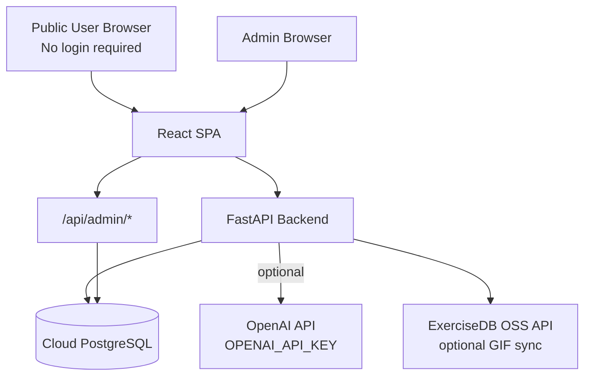
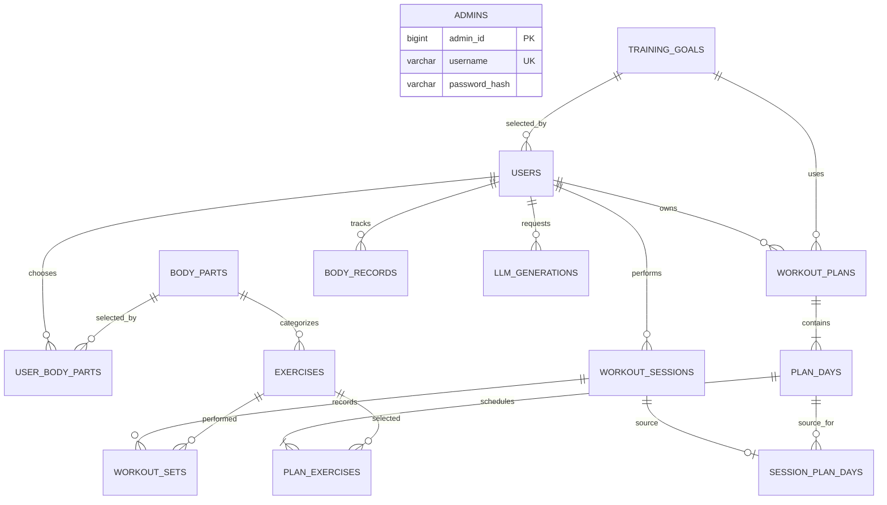
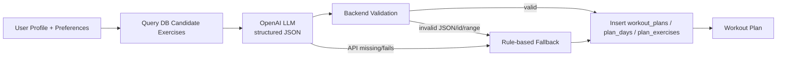
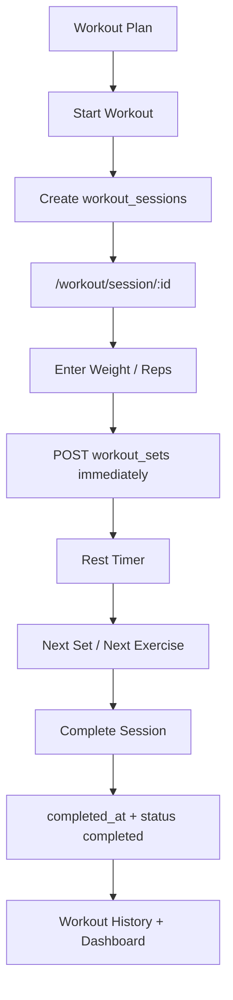

# Fitness Tracking Management System

免登入的 Full-stack Database Web Application。使用者只要透過公開網址進入，就可以建立匿名基本資料、選擇健身目標與想加強部位，系統會從資料庫找候選 Exercise，再透過 LLM 產生課表；若 LLM API 沒設定或失敗，後端會自動使用 rule-based fallback，確保功能仍可用。

> Public website 不提供 Login / Register / Email / Password。瀏覽器只保存 anonymous `user_id` 與語言偏好；所有訓練資料、課表與紀錄都存在 Cloud PostgreSQL。

## Project Description

主要功能：

- 6-step onboarding：基本資料、健身目標、訓練經驗、每週天數、訓練時間、想加強部位
- DB Exercise Library + LLM Recommendation + Backend Validation
- LLM 只能使用資料庫中的 `exercise_id`，不可憑空產生不存在的動作
- LLM API 失敗時自動 fallback 到 rule-based algorithm
- 詳細 Workout Plan：今日主要任務、參考 GIF / 圖片、肌群、器材、難度、步驟、組數、次數、休息時間
- Workout Mode：每一組 Weight / Reps 完成後立即寫入 `workout_sets`
- Session resume：重新整理 `/workout/session/:id` 可恢復進行中的訓練
- Rest timer、Add Set、Next Exercise、Completion Summary
- Workout History、Exercise History、Training Volume、Body Weight History
- Dashboard：每週訓練次數、總訓練量、最常訓練部位、最常使用 Exercise
- Admin backend：Dashboard、Users、User Detail、Statistics、Exercise Database
- Database System 展示頁：schema、row counts、PK/FK、JOIN、GROUP BY、Aggregate queries
- i18n：右上角可切換繁體中文 / English，預設繁中
- RWD：手機與電腦都可使用

## System Architecture



技術：

- Frontend：React、TypeScript、Vite、React Router、Recharts
- Backend：FastAPI、SQLAlchemy 2、Pydantic
- Database：PostgreSQL、Alembic migrations
- Deployment：Docker + Render Blueprint + Render managed PostgreSQL

## Database Architecture

目前核心資料表：

| Table | Purpose |
|---|---|
| `admins` | Admin login account，password 只存 hash |
| `users` | 匿名使用者基本資料與訓練偏好 |
| `training_goals` | Muscle Gain / Fat Loss / Strength / General Fitness |
| `body_parts` | Chest / Back / Shoulders / Biceps / Triceps / Legs / Glutes / Core |
| `user_body_parts` | User 與 Body Part 的 M:N junction table |
| `exercises` | Exercise library，中英名稱、GIF、肌群、步驟、器材、難度 |
| `workout_plans` | 產生出的週課表 |
| `plan_days` | 課表中的 Day 1 / Day 2 / ... |
| `plan_exercises` | 每天的動作與 target sets / reps / rest |
| `workout_sessions` | 實際開始的訓練 session |
| `session_plan_days` | session 對應哪一天課表 |
| `workout_sets` | 每組實際 weight / reps |
| `body_records` | 體重歷史 |
| `llm_generations` | LLM 產生課表紀錄、成功/失敗/fallback 狀態 |

### ER Diagram



資料庫設計重點：

- `user_body_parts` 使用複合主鍵，正確實作 User ↔ Body Part 的 M:N relationship
- 所有 transaction tables 皆以 FK 連回 parent table
- `workout_sets` 使用 `session_id + exercise_id + set_number` unique constraint，避免同一動作同一組重複
- `workout_sessions.status` 支援 `in_progress / completed / abandoned / cancelled`
- `workout_plans` 每個 user 最多一筆 active plan
- 設計至少符合 3NF：Goal、Body Part、Exercise 皆獨立成 lookup / entity table

更多資料庫管理教學請見 [DATABASE_MANAGEMENT_GUIDE.md](./DATABASE_MANAGEMENT_GUIDE.md)。

## LLM Architecture

LLM 不直接寫資料庫，也不能憑空創造 Exercise。



後端驗證包含：

- `exercise_id` 必須存在於 `exercises`
- exercise 必須 active
- 每天 exercise 數量必須符合 duration capacity
- `target_sets`：1–6
- `target_reps`：1–30
- `rest_seconds`：15–300
- 每天不可重複同一 exercise
- day number 必須連續且符合每週訓練天數

環境變數：

- `OPENAI_API_KEY`：後端使用；不可放前端、不可 commit
- `OPENAI_MODEL`：預設 `gpt-4.1-mini`
- `LLM_FORCE_FAILURE=true`：測試 fallback 用

## Workout Recommendation Flow

1. 使用者建立基本資料
2. 選擇 Training Goal
3. 選擇 Training Experience
4. 選擇每週訓練天數與每次時間
5. 選擇 Preferred Body Parts
6. Backend 從 DB 找候選 Exercise
7. 有 `OPENAI_API_KEY` 時呼叫 LLM 產生 structured JSON
8. Backend validation
9. 寫入 `workout_plans`、`plan_days`、`plan_exercises`
10. 若 LLM 失敗，寫入 `llm_generations` 並使用 fallback plan

## Workout Tracking Flow



## Admin System

Admin routes are separated from the public user flow:

- `/admin/login`
- `/admin`
- `/admin/users`
- `/admin/users/:userId`
- `/admin/statistics`
- `/admin/exercises`

Admin dashboard metrics:

- total users
- new users today
- total plans
- total sessions
- completed sessions today
- total exercises
- total training volume

Admin user detail includes:

- profile
- preferred body parts
- AI / fallback workout plans
- workout history
- workout sets
- body weight history
- LLM generation records

## i18n

Frontend i18n files:

- `frontend/src/i18n/zh-TW.json`
- `frontend/src/i18n/en.json`

預設語言是繁體中文。右上角可切換 English，語言偏好存在 localStorage。

Exercise 顯示邏輯：

- zh-TW：優先使用 `exercise_name_zh`、`description_zh`、`instructions_zh`
- English：優先使用 `exercise_name_en`、`description_en`、`instructions_en`

## Exercise GIF Source

系統會在 seed 時可選擇同步 ExerciseDB OSS API：

- `EXERCISEDB_API_URL=https://oss.exercisedb.dev/api/v1/exercises`
- `EXERCISEDB_SYNC_ON_SEED=true`

如果 ExerciseDB 無法連線或找不到對應 GIF，前端會使用本機 SVG fallback：

- `frontend/public/exercise-images/*.svg`

因此 UI 不會因外部圖片 API 失敗而壞掉。

## Installation

需求：

- Node.js 22+
- Python 3.14+
- PostgreSQL 16+
- `uv`

```bash
cd frontend
npm ci

cd ../backend
uv sync
```

## Environment Variables

請複製範例檔，不要把真實 `.env` commit 到 GitHub：

```bash
cp .env.example .env
cp backend/.env.example backend/.env
cp frontend/.env.example frontend/.env
```

| Variable | Used by | Description |
|---|---|---|
| `DATABASE_URL` | Backend | PostgreSQL connection string |
| `SECRET_KEY` | Backend | Admin token signing secret |
| `ADMIN_BOOTSTRAP_USERNAME` | Backend | Initial admin username |
| `ADMIN_BOOTSTRAP_PASSWORD` | Backend | Initial admin password；只放 env |
| `OPENAI_API_KEY` | Backend | Optional LLM planning key；不要放 GitHub |
| `OPENAI_MODEL` | Backend | LLM model，default `gpt-4.1-mini` |
| `LLM_FORCE_FAILURE` | Backend | Set `true` to test fallback |
| `LLM_TIMEOUT_SECONDS` | Backend | OpenAI request timeout |
| `EXERCISEDB_API_URL` | Backend | Optional GIF/instruction sync |
| `EXERCISEDB_SYNC_ON_SEED` | Backend | `true` 時 seed 嘗試同步 GIF |
| `CORS_ORIGINS` | Backend | Local frontend origins |
| `FRONTEND_URL` | Backend | Public frontend URL |
| `VITE_API_URL` | Frontend | Public API base URL；不可放 secret |

## Local Development

```bash
cd backend
uv run alembic upgrade head
uv run fitness-seed
uv run uvicorn backend.main:app --reload --host 127.0.0.1 --port 8000
```

另一個終端：

```bash
cd frontend
npm run dev
```

開啟：

- Frontend: `http://localhost:5173`
- API docs: `http://localhost:8000/docs`
- Admin: `http://localhost:5173/admin/login`

檢查：

```bash
cd backend
uv run ruff check .
uv run pytest

cd ../frontend
npm run lint
npm test
npm run build
```

## Production Deployment

本專案使用 Render Blueprint。

`render.yaml` 會建立：

- Docker Web Service
- Render managed PostgreSQL
- `DATABASE_URL` 自動由 Render database 注入
- `SECRET_KEY` 自動產生
- `OPENAI_API_KEY` 與 `ADMIN_BOOTSTRAP_PASSWORD` 使用 `sync: false`，需要你在 Render Dashboard 填入

部署步驟：

1. Push repository 到 GitHub
2. Render → New → Blueprint
3. 連接 `https://github.com/Loisekoy/-.git`
4. Render 讀取 `render.yaml`
5. 到 Web Service Environment 填入：
   - `ADMIN_BOOTSTRAP_PASSWORD`
   - `OPENAI_API_KEY`（可選；不填會 fallback）
6. Deploy

Docker 啟動時會自動執行：

```bash
alembic upgrade head && fitness-seed && uvicorn backend.main:app --host 0.0.0.0 --port ${PORT}
```

## Live Demo

Public URL:

[https://fitness-tracking-management-system.onrender.com](https://fitness-tracking-management-system.onrender.com)

Database System page:

[https://fitness-tracking-management-system.onrender.com/database](https://fitness-tracking-management-system.onrender.com/database)

Admin page:

[https://fitness-tracking-management-system.onrender.com/admin/login](https://fitness-tracking-management-system.onrender.com/admin/login)

## Security and Privacy Scope

- Public user flow intentionally has no authentication.
- `user_id` is an anonymous identifier, not a secure login credential.
- Do not enter sensitive personal health data in the demo.
- Admin password is hashed in `admins.password_hash`.
- Secrets are loaded only from environment variables.
- `OPENAI_API_KEY`, `DATABASE_URL`, passwords, and API keys must never be committed.
