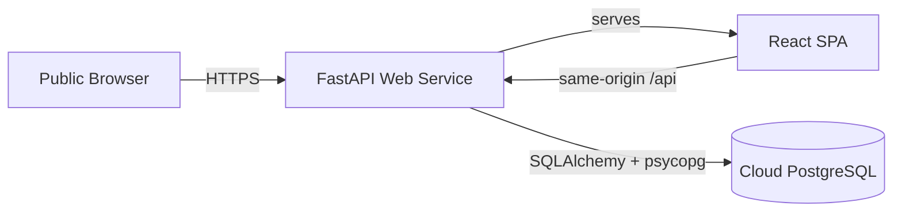
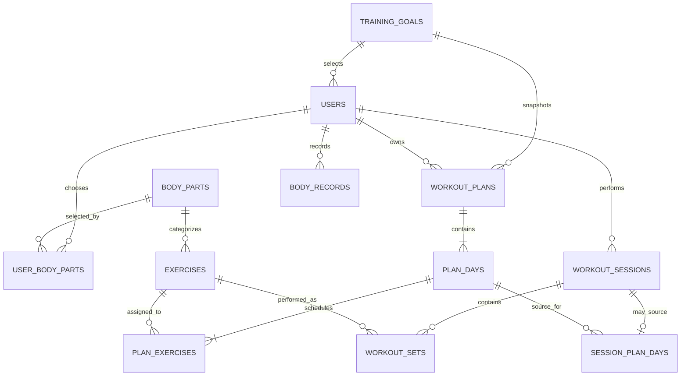

# Fitness Tracking Management System

免登入的全端健身紀錄管理系統。訪客可直接建立匿名基本資料，選擇訓練目標與重點部位，取得規則式推薦課表，記錄每一組 Weight / Reps，並透過 Dashboard 查看 Training Volume、訓練頻率與體重歷史。

> 本專案依需求刻意不提供 Login、Register、Email 或 Password。瀏覽器只保存匿名 `user_id`；清除瀏覽器資料後無法復原識別碼。這是課程展示系統，不適合存放敏感個資。

## Project Description

主要功能：

- 五步驟匿名建檔流程
- Rule-Based Workout Recommendation（不使用 AI API）
- Workout Plan 檢視與目標組數／次數修改
- Workout Session 與每組 Weight / Reps 紀錄
- Workout、Exercise、Body Weight History
- Dashboard：Training Volume、工作組數、訓練次數、最常訓練部位與最常使用動作
- Exercises 搜尋、篩選與完整 CRUD API
- 使用者、體重、課表、訓練紀錄的 CRUD API
- 桌機與手機響應式介面

技術架構：

- Frontend：React、TypeScript、Vite、React Router、Recharts
- Backend：FastAPI、SQLAlchemy 2、Pydantic
- Database：PostgreSQL、Alembic migrations
- Deployment：Docker + Render Web Service；建議搭配 Neon PostgreSQL



## Database Design

資料庫共 12 張資料表：

| Table | Purpose | Important Keys |
|---|---|---|
| `training_goals` | 訓練目標與預設處方 | PK `training_goal_id` |
| `users` | 匿名基本資料與訓練偏好 | PK `user_id`; FK `training_goal_id` |
| `body_parts` | 標準化身體部位 | PK `body_part_id` |
| `user_body_parts` | User 與 Body Part 的 M:N junction table | Composite PK/FK |
| `exercises` | 動作資料庫 | PK `exercise_id`; FK `body_part_id` |
| `workout_plans` | 產生的週課表 | PK `plan_id`; FK `user_id`, `training_goal_id` |
| `plan_days` | 課表中的訓練日 | PK `plan_day_id`; FK `plan_id` |
| `plan_exercises` | 每日動作與目標處方 | PK `plan_exercise_id`; FK `plan_day_id`, `exercise_id` |
| `workout_sessions` | 實際訓練事件 | PK `session_id`; FK `user_id` |
| `session_plan_days` | Session 的選填課表來源 | PK/FK `session_id`; FK `plan_day_id` |
| `workout_sets` | 每組實際 Weight / Reps | PK `workout_set_id`; FK `session_id`, `exercise_id` |
| `body_records` | 體重歷史 | PK `body_record_id`; FK `user_id` |

完整欄位、data types、PK/FK、constraints、indexes、關係、正規化與推薦規則請見 [DATABASE_DESIGN.md](./DATABASE_DESIGN.md)。可執行的 JOIN / GROUP BY / aggregate 範例請見 [SQL_QUERIES.md](./docs/SQL_QUERIES.md)。

## ER Diagram



## Installation

需求：

- Node.js 22+
- Python 3.14+
- PostgreSQL 16+
- [`uv`](https://docs.astral.sh/uv/)（建議）

安裝前端：

```bash
cd frontend
npm ci
```

安裝後端：

```bash
cd backend
uv sync
```

## Environment Variables

先複製範例檔，切勿把真實 `.env` commit 到 GitHub：

```bash
cp .env.example .env
cp backend/.env.example backend/.env
cp frontend/.env.example frontend/.env
```

| Variable | Used by | Description |
|---|---|---|
| `DATABASE_URL` | Backend | PostgreSQL connection string；可接受 `postgresql://` 或 `postgresql+psycopg://` |
| `CORS_ORIGINS` | Backend | 本機分離開發時允許的前端 origins，以逗號分隔 |
| `FRONTEND_URL` | Backend | 前端公開網址（文件與部署識別用途） |
| `VITE_API_URL` | Frontend | API base URL；production 同網域使用 `/api` |

所有 `.env`、Password、API key 與 connection string 已由 `.gitignore` 排除。`VITE_` 變數會進入瀏覽器 bundle，絕對不可放敏感資料。

## Local Development

1. 建立 PostgreSQL database，並在 `backend/.env` 設定 `DATABASE_URL`。
2. 執行 migration 與 seed：

```bash
cd backend
uv run alembic upgrade head
uv run fitness-seed
```

3. 啟動 API：

```bash
uv run uvicorn backend.main:app --reload --host 127.0.0.1 --port 8000
```

4. 另一個終端啟動前端：

```bash
cd frontend
npm run dev
```

5. 開啟 `http://localhost:5173`；API docs 位於 `http://localhost:8000/docs`。

測試與靜態檢查：

```bash
cd backend
uv run ruff check .
uv run pytest

cd ../frontend
npm run lint
npm test
npm run build
```

也可用 production Docker image 啟動單一服務：

```bash
docker build -t fitness-tracker .
docker run --env-file .env -p 8000:8000 fitness-tracker
```

開啟 `http://localhost:8000`。

## Deployment

建議組合：Neon PostgreSQL + Render Web Service。

1. 在 Neon 建立 PostgreSQL project，複製 connection string。
2. 將此 repository push 到 GitHub。
3. 在 Render 選擇 **New → Blueprint**，連接 repository；Render 會讀取根目錄的 `render.yaml` 與 `Dockerfile`。
4. Render 要求 `DATABASE_URL` 時，貼上 Neon connection string。不要把它寫入 GitHub。
5. 部署啟動時會自動執行 `alembic upgrade head` 與 idempotent seed。
6. 健康檢查路徑為 `/api/health`；API 文件為 `/docs`。
7. 部署完成後，任何人都可直接開啟 Render 的公開 HTTPS URL，不需要 GitHub 帳號或網站登入。

若改用 Render Free PostgreSQL，請注意其資料庫目前會在建立 30 天後到期；課程長期展示建議使用不設 30 天到期的 Neon Free plan，或升級付費 PostgreSQL。

## Live Demo

尚未部署。完成 GitHub remote 與雲端帳號授權後，將在此更新公開網址：

```text
https://<your-service-name>.onrender.com
```

## Recommendation Algorithm

`rules-v1` 的輸入為 Training Goal、Training Experience、Preferred Body Parts、Training Days Per Week 與 Training Duration：

1. 根據 2–6 天選擇基礎 split。
2. 30 / 60 / 90 分鐘分別配置最多 4 / 6 / 8 個動作。
3. 每個偏好部位盡量在不同訓練日至少出現兩次。
4. 仍保留胸、背、肩、腿、臀、核心與手臂的平衡覆蓋。
5. 依經驗、動作難度、複合動作優先、前一日重複與本週使用次數評分。
6. 依 Goal 產生 sets、reps、rest；新課表啟用時舊課表自動 archived。

詳細 pseudo-code 與決策表位於 [DATABASE_DESIGN.md](./DATABASE_DESIGN.md#11-workout-recommendation-algorithm-rules-v1)。

## Security and Privacy Scope

依需求，本系統沒有 authentication 或 authorization。`user_id` 是匿名識別碼，不是存取權限；知道某個 UUID 的人可能透過 API 操作該筆資料。因此請只用暱稱與測試資料，不要輸入真實敏感健康資訊。若未來要正式公開收集個資，必須另行加入登入、授權、隱私政策與資料刪除流程。
